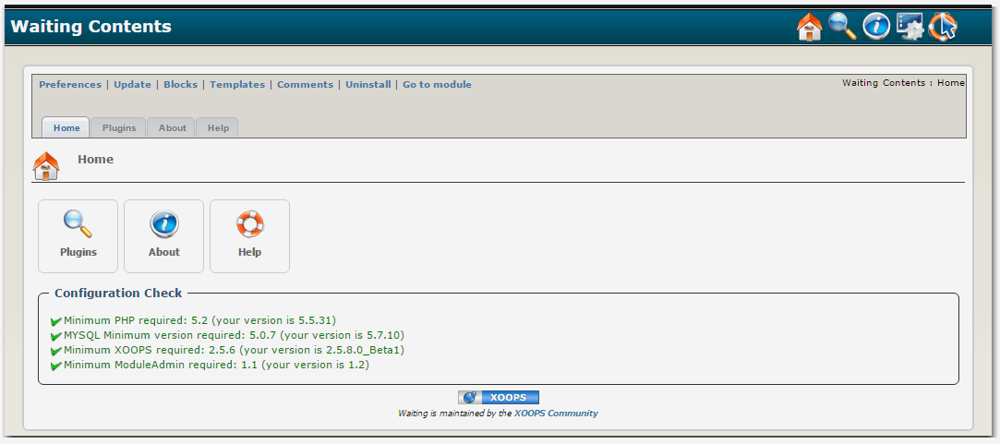

# Introduction

## Module xLanguage

# Module Waiting
#### for XOOPS 2.5.8
      

            
### User Manual

© 2016 XOOPS Project ([www.xoops.org](https://xoops.org))  

### Module Purpose

This module offers you an extensible waiting contents block into your XOOPS.

*Figure 1: Main view of the Waiting Module (Admin side)*

## Download/Fork the Module  

### Download/Fork the Module 

**You can fork the module --&gt;** [**here**](https://github.com/XoopsModules25x/waiting)**\)**

### How to Contribute

[You can contribute on GitHub](https://github.com/XoopsDocs/waiting-tutorial). Changes will be [pushed to Gitbook.io automatically](https://www.gitbook.com/book/xoops/waiting-tutorial/activity) when the [main repository](https://github.com/XoopsDocs/waiting-tutorial) changes.

Editing the book can be done either by updating the markdown files with a text editor, or opening the repository in [the Gitbook desktop app](https://github.com/GitbookIO/editor/blob/master/README.md). The desktop app will give you a live preview option.

## Table of Content

* [Install/Uninstall](install-uninstall.md)
* [Administration Menu](administration-menu.md)
* [Preferences](preferences.md)
* [Operating Instructions](operating-instructions.md)
* [The User Side](the-user-side.md)
* [Blocks](blocks.md)
* [Templates](templates.md)
* [Miscellaneous](other.md) 
* [Module Credits](module-credits.md)
* [About XOOPS CMS](about-xoops-cms.md)

### License:

  
Unless specified, this content is licensed under a [Creative Commons Attribution-NonCommercial-ShareAlike 4.0 International License](http://creativecommons.org/licenses/by-nc-sa/4.0/).

All derivative works are to be attributed to XOOPS Project \([www.xoops.org](https://xoops.org)\)

All derivative works are to be attributed to XOOPS Project ([www.xoops.org](https://xoops.org))
